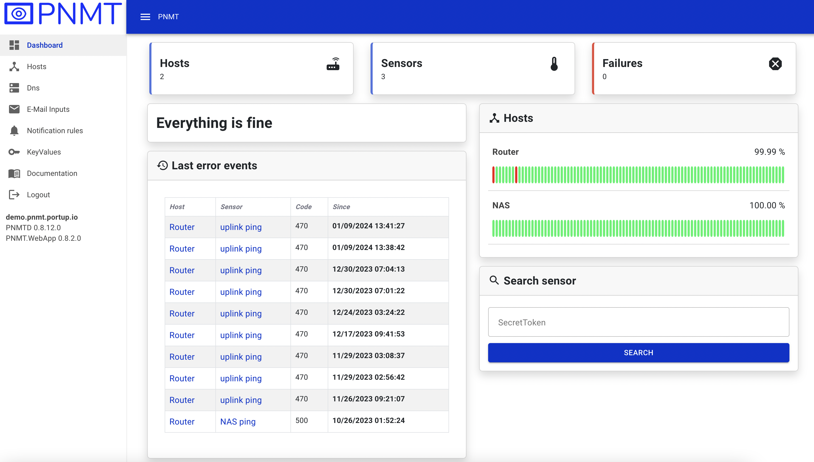

# PNMTD - Personal Network Monitoring Tool

A monitoring application to keep an eye on Hosts, Emails, and DNS Zones. Useful for additional oversight of main monitoring systems.

 

# ⭐ Features
 - Monitoring state and uptime of remote systems
 - "Sensors" to monitoring using Ping, HTTP, HTTP-Heartbeat, E-Mail Heartbeat
 - DNS Zone monitoring
 - Notifications via E-Mail and Pushover
 - Custom intervals
 - Group Monitors (Sensors) in hosts
 - Frontend (Blazor): [PNMT.WebApp](https://github.com/muqiuq/PNMT.WebApp)

# 🧸 Motivation
 - I was using uptimerobot as oversight monitoring, but needed more features, especially the DNS Zone monitoring.
 - I needed to automatically process e-mails from secondary monitoring tools (like Synology NAS HyperBackup, Zabbix, ...).
 - Improve my C# Skills and learn Blazor ([PNMT.WebApp](https://github.com/muqiuq/PNMT.WebApp)).

